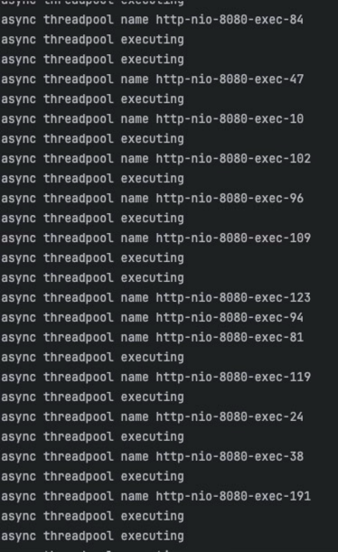

# Thread Pool Research
## 1. 多线程的Java实现
### 业务中什么场景使用多线程

**主线程执行主要业务，非时效性的业务由工作线程执行：**

 

**主线程执行业务，工作线程执行业务，获取响应与结果后由主线程处理：**


### 实现线程任务的方式
#### Runnable 实现类实现run()方法
```
@Component
public class ThreadRunnable implements Runnable{
    @Autowired
    ThreadMapper threadMapper;
    @Override
    public void run() {
        System.out.println("runnable thread running");
        System.out.println("runnable thread name " + Thread.currentThread().getName());
        try {
            Thread.sleep(1);
        } catch (InterruptedException e) {
            throw new RuntimeException(e);
        }
        threadMapper.insertThreadLog("RunnableLog");
        System.out.println("runnable thread done");
    }
}

#主线程调用
 Thread insertLog = new Thread(threadRunnable);
 insertLog.start();
```
#### Callable 实现类实现Callable的call()方法：
```
@Component
public class ThreadCallable implements Callable<String> {
    @Autowired
    ThreadMapper threadMapper;
    @Override
    public String call() throws Exception {
        System.out.println("callable running");
        System.out.println("callable thread name " + Thread.currentThread().getName());
        try {
            Thread.sleep(1000);
        } catch (InterruptedException e) {
            throw new RuntimeException(e);
        }
        int insertResult = threadMapper.insertThreadLog("CallableLog");
        System.out.println("callablethread thread done");
        return "insertResult" + insertResult;
    }
}

#主线程调用 并获取结果
 FutureTask<String> ft = new FutureTask<>(threadCallable);
 Thread insertLog = new Thread(ft);
        // insert log
insertLog.start();
try {
     System.out.println(ft.get());
     } catch (Exception e) {
      e.printStackTrace();
}
```
Callable 能实现工作线程的接口返回

上述两种实现均使用

java.util.concurrent

java自己的多线程工具，并都能实现上文提到的业务场景。

## 2. Springboot如何使用多线程
### @Async

这个注解标注的方法会成为异步方法，只能返回void或compleateFuture，另外必须在启动类/线程池配置类上标注@EnableAsync
```
@Async
public void asyncService()  {
    System.out.println("async thread executing");
    System.out.println("async thread name " + Thread.currentThread().getName());
    try {
        Thread.sleep(1000);
    } catch (InterruptedException e) {
        throw new RuntimeException(e);
    }
    threadMapper.insertThreadLog("async");
    System.out.println("async thread Done");
}
```
当该注解在使用，但是springboot中并没有配置线程池时，会使用SimpleAsyncTaskExecutor（Springboot提供），每次拉取新工作线程。

当该方法返回compleateFuture时，可以返回工作线程执行的返回值
```
@Async
public CompletableFuture<String> asyncService()  {
    System.out.println("async thread executing");
    System.out.println("async thread name " + Thread.currentThread().getName());
    try {
        Thread.sleep(1000);
    } catch (InterruptedException e) {
        throw new RuntimeException(e);
    }
    int insertResult = threadMapper.insertThreadLog("async");
    System.out.println("async thread Done");
    return new CompletableFuture<String>().completedFuture("insertResult "+ insertResult);
}
#上游拿取工作进程执行结果
 CompletableFuture result = threadPoolSevice.asyncService();
 return Response.success("controller data" + result.get());
```
### CompletableFuture

CompletableFuture作为包装类，可以作为Async的返回，也可以结合Java 8 lambda表达式实现自己的api：
```
@Override
public Response completableFutureService() throws ExecutionException, InterruptedException {
    System.out.println("CompletableFuture main thread executing");
    System.out.println("CompletableFuture main thread name " + Thread.currentThread().getName());
    CompletableFuture<Integer> step1 = CompletableFuture.supplyAsync(() -> {
        System.out.println("CompletableFuture step 1 thread executing");
        System.out.println("CompletableFuture step 1 thread name " + Thread.currentThread().getName());
        try {
            Thread.sleep(1);
        } catch (InterruptedException e) {
            throw new RuntimeException(e);
        }
        return 1;
    
    CompletableFuture<Integer> step2 = CompletableFuture.supplyAsync(() -> {
        System.out.println("CompletableFuture step 2 thread executing");
        System.out.println("CompletableFuture step 2 thread name " + Thread.currentThread().getName());
        int insertResult = threadMapper.insertThreadLog("CompletableFuture");
        try {
            Thread.sleep(1);
        } catch (InterruptedException e) {
            throw new RuntimeException(e);
        }
        return insertResult;
    });
    CompletableFuture<Void> allOf = CompletableFuture.allOf(step1,step
    CompletableFuture<Integer> resultFuture = allOf.thenApply(v -> {
        Integer result1 = step1.join();
        Integer result2 = step2.join();
        return result1 + result2;
    });

    Integer result = resultFuture.get();
    return Response.success(result);
}
```
上述代码实现了两个并行任务，并汇总结果返回controller。需要注意的是，即使没配置线程池，该方法依旧使用Springboot的ForkJoin线程池。

关于ForkJoin线程池技术：
[ForkJoin Algorithm](https://www.bilibili.com/video/BV1M34y1q7M2/?spm_id_from=333.337.search-card.all.click&vd_source=777b66d9ea6bb56ea53f120df4b32bb6)

## 3. 为什么使用线程池
每次拿一个新的线程执行异步任务，这会造成大量的时间消耗在创建线程，cpu内存调度。
如果不使用多线程，会在cpu中建立大量独立线程。例如下图runnable压测log：


针对线程池use/unuse，总结了如下图：


## 4. 线程池配置
### 如何让springboot使用线程池
#### @Aync
```
@Configuration
@EnableAsync
public class TreadPoolConfig {
    @Bean
    public Executor taskExecutor() {
        return new ThreadPoolExecutor(
                1,  // core thread. always running
                1,  // max thread till the max one when queue up to limit
                60, TimeUnit.SECONDS,  // max thread alive tim
                new LinkedBlockingQueue<>(10),  // queue limit
                new ThreadPoolExecutor.DiscardPolicy()  // refuse policy
        );
    }
}
```
只需在线程池配置类中添加@EnableAsync注解即可。
#### CompletableFuture
```
public Response completableFutureService() throws ExecutionException, InterruptedException {
        System.out.println("CompletableFuture pool main thread executing");
        System.out.println("CompletableFuture pool main thread name " + Thread.currentThread().getName());
        CompletableFuture<Integer> step1 = CompletableFuture.supplyAsync(() -> {
            System.out.println("CompletableFuture pool step 1 thread executing");
            System.out.println("CompletableFuture pool step 1 thread name " + Thread.currentThread().getName());
            try {
                Thread.sleep(1);
            } catch (InterruptedException e) {
                throw new RuntimeException(e);
            }
            return 1;
        },threadPoolTaskExecutor);
```
threadPoolTaskExecutor线程池配置类作为CompletableFuture api 异步调用的输入参数即可

### 线程池分类以及表现
#### 固定线程池
```
@Bean
public Executor taskExecutor() {
    return Executors.newFixedThreadPool(5);
}
```
使用轮询策略使用线程，如图


#### 缓存线程池
```
@Bean
public Executor taskExecutor() {
    return Executors.newCachedThreadPool();
}
```
短时大并发任务时，创建大量线程之后，逐渐销毁不再使用的线程：


上图为压测结果，压测短时创建大量线程。

#### 单一工作线程池

```
@Bean
public Executor taskExecutor() {
    return Executors.newSingleThreadExecutor();
}
```
线程池有且只有一个工作线程：pool-3-thread-1


#### ScheduledThreadPool
```
@Bean
public Executor taskExecutor() {
    return Executors.newScheduledThreadPool(2);
}
```


结合spring的Scheduled注解使用，如果将它作为线程池交给异步方法和表现与固定线程池一样。

#### ThreadPoolExecutor
该线程池两种来源：
1. springframework.scheduling.concurrent.ThreadPoolTaskExecutor
2. java.util.concurrent.ThreadPoolExecutor;
两者配置方式不同，但是配置参数相同
```
#concurrent
@Bean
 public Executor taskExecutor() {
     return new ThreadPoolExecutor(
             1,  // core thread. always running
             1,  // max thread till the max one when queue up to limit
             60, TimeUnit.SECONDS,  // max thread alive time
             new LinkedBlockingQueue<>(10),  // queue limit
             new ThreadPoolExecutor.DiscardPolicy()  // refuse policy
     );
 }
 
#springframework
 @Bean
 public ThreadPoolTaskExecutor executor() {
     ThreadPoolTaskExecutor executor = new ThreadPoolTaskExecutor();
     executor.setCorePoolSize(2);
     executor.setMaxPoolSize(4);
     executor.setQueueCapacity(10);
     executor.setThreadNamePrefix("springboot-thread-");
     executor.initialize();
     return executor;
 }
```
配置方面， 
1. core thread 核心线程数。 推荐值：N = CPU 核心数 × (1 + I/O 时间 ÷ CPU 时间)
2. max thread 最大线程数，核心线程满后会将任务放到队列，队列也满后增加线程，直到最大线程。
3. queue limit 队列容纳任务数量。
4. alive time 线程空闲时间 （最大线程数经过空闲时间会被销毁） 
5. refuse policy 到达最大线程数，队列满后舍弃任务的策略
6. ThreadNamePrefix 线程别名
##### 关于队列参数
###### ArrayBlockingQueue
```
new ThreadPoolExecutor(corePoolSize, maxPoolSize, keepAliveTime, TimeUnit.SECONDS, 
                       new ArrayBlockingQueue<>(100));
```
基于数组：队列大小有限，可以避免无限制的内存占用。
###### LinkedBlockingQueue
```
new ThreadPoolExecutor(corePoolSize, maxPoolSize, keepAliveTime, TimeUnit.SECONDS, 
                       new LinkedBlockingQueue<>());


new ThreadPoolExecutor(corePoolSize, maxPoolSize, keepAliveTime, TimeUnit.SECONDS, 
                       new LinkedBlockingQueue<>(100));
```
基于链表：默认无限大小，可能会导致OOM，但也可根据业务添加队列大小。
###### SynchronousQueue
```
new ThreadPoolExecutor(corePoolSize, maxPoolSize, keepAliveTime, TimeUnit.SECONDS, 
                       new SynchronousQueue<>());
```
不会产生队列，当核心线程不够用，会立即使用最大线程工作。
###### PriorityBlockingQueue
```
new ThreadPoolExecutor(corePoolSize, maxPoolSize, keepAliveTime, TimeUnit.SECONDS, 
                       new PriorityBlockingQueue<>());
```
带有优先级的队列，会根据任务优先级使用：任务必须实现 Comparable 接口，或者使用自定义的 Comparator。
```
伪代码如下：
Comparator<Task> comparator = (task1, task2) -> Integer.compare(task1.getPriority(), task2.getPriority());
PriorityBlockingQueue<Task> queue = new PriorityBlockingQueue<>(10, comparator);
```
前提是每一个异步方法实现优先级的Comparable接口。
##### 舍弃策略
###### AbortPolicy 默认：
抛出异常，


###### CallerRunsPolicy：
主线程承接任务，变为同步方法：

async threadpol的线程名与主线程一致



###### DiscardPolicy：

直接抛弃没有异常

###### DiscardOldestPolicy：
移除队列最开始进入的任务，并重新尝试最近进入的任务。
#### ThreadPoolExecutor 监控策略
ThreadPoolExecutor 支持返回正在运行的线程使用情况，参考以下代码新建一个接口监测运行情况：
```
@RequestMapping(value = "/monitor",method = RequestMethod.GET)
    public Response monitor()  {
        int activeCount = executor.getActiveCount();
        int corePoolSize = executor.getCorePoolSize();
        int maxPoolSize = executor.getMaxPoolSize();
        int queueSize = executor.getThreadPoolExecutor().getQueue().size();
        long completedTaskCount = executor.getThreadPoolExecutor().getCompletedTaskCount();
        HashMap data = new HashMap<String,Integer>();
        data.put("activeCount",activeCount);
        data.put("corePoolSize",corePoolSize);
        data.put("maxPoolSize",maxPoolSize);
        data.put("queueSize",queueSize);
        data.put("completedTaskCount",completedTaskCount);
        return Response.success(data);
    }
```
压测中：


压测后：


还可以使用actuator thread接口进行监控。
那么当springboot项目启动时，是否真的相对应的核心线程被拉起呢：
```
public static void main(String[] args) {
        ApplicationContext context = SpringApplication.run(Application.class, args);
        ThreadPoolTaskExecutor executor = context.getBean("executor", ThreadPoolTaskExecutor.class);
        int activeCount = executor.getActiveCount();
        int corePoolSize = executor.getCorePoolSize();
        int maxPoolSize = executor.getMaxPoolSize();
        int poolSize = executor.getPoolSize();
        int queueSize = executor.getThreadPoolExecutor().getQueue().size();
        long completedTaskCount = executor.getThreadPoolExecutor().getCompletedTaskCount();
        HashMap data = new HashMap<String,Integer>();
        data.put("activeCount",activeCount);
        data.put("poolSize",poolSize);
        data.put("corePoolSize",corePoolSize);
        data.put("maxPoolSize",maxPoolSize);
        data.put("queueSize",queueSize);
        data.put("completedTaskCount",completedTaskCount);
        System.out.println(data);
    }
```
启动后并不是核心线程数到达预期，在没有任务时并不会占用物理线程。（queueSize": 0）

```
{
"data": {
"activeCount": 0,
"queueSize": 0,
"poolSize": 1,
"corePoolSize": 2,
"completedTaskCount": 1,
"maxPoolSize": 4
},
"code": "200"
}
```
当调用一次后，也不会到达核心线程数（"queueSize": 1）
```
{
"data": {
"activeCount": 0,
"queueSize": 0,
"poolSize": 2,
"corePoolSize": 2,
"completedTaskCount": 18,
"maxPoolSize": 4
},
"code": "200"
}
```
当大量调用后会保持核心线程数，并一直保持。

### 上述线程池总结


## 5. Springboot如何实现多连接池作用于不同方法
有时不同业务需要配置不同线程池，其中CompletableFuture的较为简单，只需替换最后一个线程池参数即可。而对Async来说如下
```
@Bean(name = "synctaskExecutor")
    public TaskExecutor synctaskExecutor() {
        return new SyncTaskExecutor();
    }
```
首先需要在配置线程池是指定name，并在异步方法中的@Async注解中添加bean name，如下：
```
@Override
@Async("synctaskExecutor")
public CompletableFuture asyncService() {
    System.out.println("async threadpool executing");
    System.out.println("async threadpool name " + Thread.currentThread().getName());
    int insertResult = threadMapper.insertThreadLog("asyncPool");
    System.out.println("async threadpool Done");
    return new CompletableFuture<String>().completedFuture("threadpool insertResult:"+ insertResult);
}
```

## 6. SynctaskExecutor的使用

SynctaskExecutor虽然是Executor，但是并不是一个线程池。它不会建立任何一条工作线程，那它的使用伪代码如下：

```
@Override
@Async(${ThreadPool})
public CompletableFuture asyncService() {
    System.out.println("async threadpool executing");
    System.out.println("async threadpool name " + Thread.currentThread().getName());
    int insertResult = threadMapper.insertThreadLog("asyncPool");
    System.out.println("async threadpool Done");
    return new CompletableFuture<String>().completedFuture("threadpool insertResult:"+ insertResult);
}
```

${ThreadPool}作为入参，我们可以根据不同环境读不同的perproties进行配置，在UT环境下我们配置为SynctaskExecutor，即可让所有的在sit/uat/prod中的异步方法同步化。
保证顺序执行完整case。

当然，上述方案的前提是必须配置SynctaskExecutor连接池：
```
@Bean(name = "synctaskExecutor")
public TaskExecutor synctaskExecutor() {
    return new SyncTaskExecutor();
}
```
## 7. 如何处理异步方法的异常
以@Async为例

如果该异步不会依赖主线程执行，如果不进行异常处理，我们除了实时监控log外无法有别的监控手段，并且主服务正常返回200的code，无法感知问题。
针对这种情况，需要添加异常处理手段。
### try-catch
```
@Async
    public CompletableFuture asyncService() {
        System.out.println("async threadpool executing");
        System.out.println("async threadpool name " + Thread.currentThread().getName());
        int insertResult = 0;
        try {
            insertResult = threadMapper.insertThreadLog("asyncPool");
            int exception= 1/0;
            System.out.println("async threadpool Done");
            return new CompletableFuture<String>().completedFuture("threadpool insertResult:"+ insertResult);
        } catch (Exception e) {
            System.out.println("async with exception");
            return CompletableFuture.failedFuture(e);
        }
    }
```
其中
```
catch (Exception e) {}
```
中的代码块可以作为异常处理记录log，添加告警。具体报错如下：


try catch并不仅仅能被异步方法使用，实际所有的方法都可以使用java异常处理机制，我们需要在每一个可能出现问题的代码块中添加这类一场捕获方式，这并不高效。

### AsyncConfigurer

AsyncConfigurer 作为全局异常管理器，可以管理异步任务中返回为void的异步方法，具体配置如下：

```
@Configuration
@EnableAsync
public class TreadPoolConfig implements AsyncConfigurer {

    @Override
    public AsyncUncaughtExceptionHandler getAsyncUncaughtExceptionHandler() {
        return new AsyncUncaughtExceptionHandler(){
            @Override
            public void handleUncaughtException(Throwable ex, Method method, Object... params) {
                System.out.println("this from handleUncaughtException");
            }
        };
    }
}
```
执行结果如下，异步方法的异常会被捕获并且进行处理：

## 8. 附录 启动配置

repo启动需要配置mysql，zipkin，jdk17

docker配置mysql
```
docker run -d \
--name mysql \
--restart unless-stopped \
-e MYSQL_ROOT_PASSWORD=123456 \
-e MYSQL_DATABASE=THREADPOC \
-v /Users/orjujeng/IdeaProjects/mysql_dev_env:/var/lib/mysql \
-e TZ=Asia/Shanghai \
-p 3306:3306 \
mysql:8.0.39
```

DB log表的DDL语句：

```
- THREADPOC.threadlog definition

CREATE TABLE `threadlog` (
`id` bigint NOT NULL AUTO_INCREMENT,
`function` varchar(100) NOT NULL,
`insert_date` TIMESTAMP(6) NOT NULL,
PRIMARY KEY (`id`)
) ENGINE=InnoDB DEFAULT CHARSET=utf8mb4 COLLATE=utf8mb4_0900_ai_ci;
```
Zipkin 配置方式
```
docker run -d -p 9411:9411 openzipkin/zipkin
```

线程测试controller

[ThreadController.java](src%2Fmain%2Fjava%2Fcom%2Forjujeng%2Fthreadpool%2Fcontroller%2FThreadController.java)

线程池测试controller

[ThreadPoolController.java](src%2Fmain%2Fjava%2Fcom%2Forjujeng%2Fthreadpool%2Fcontroller%2FThreadPoolController.java)

## 8. 附录 测试完整结果：

[ThreadPool.pdf](src%2Fmain%2Fresources%2FThreadPool.pdf)


